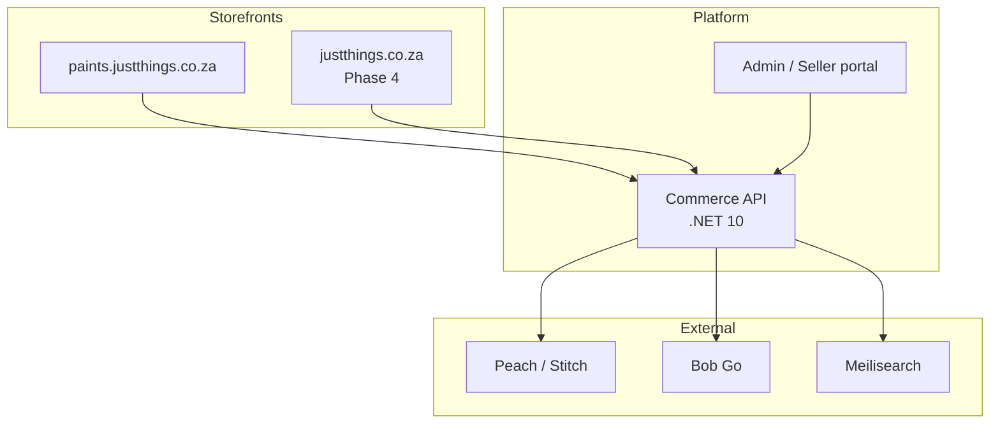

# Architecture

Status: **proposed**. The commerce platform choice is open — see
`decisions/0001-commerce-platform.md`. This document assumes the recommended
option (custom .NET 10 core) and flags where a Medusa decision would change it.

## Shape

A single platform serving multiple vertical storefronts, launching with one.

Verticals are data, not deployments. A new vertical is a `Vertical` row, a
theme, a category tree and a DNS record — not a fork.

## Backend

Clean Architecture, matching the pattern already running in the xcii
business-directory API (.NET 10, `Domain` / `Application` / `Infrastructure` /
`Api` / `Shared`, EF Core, central package management, test pyramid).

| Layer | Contents |
| --- | --- |
| `Domain` | Catalogue, Colour, Pricing, Ordering, Fulfilment aggregates. No EF, no HTTP. |
| `Application` | Use cases, validators, the price resolver, the coverage calculator |
| `Infrastructure` | EF Core + PostgreSQL, payment and courier adapters, search indexing |
| `Api` | Minimal APIs, auth, rate limiting, storefront and admin surfaces |

### Bounded contexts

Modules inside one deployable, with enforced boundaries. A modular monolith
until traffic justifies otherwise — splitting later is cheaper than distributed
transactions now.

| Context | Owns |
| --- | --- |
| **Catalogue** | Products, variants, categories, brands, media |
| **Colour** | Colour systems, colours, tint bases, availability, recipes |
| **Pricing** | Price resolution, tiers, promotions |
| **Ordering** | Cart, checkout, orders, returnability |
| **Fulfilment** | Shipments, rates, hazard rules, tracking |
| **Sellers** | Onboarding, offers, commission, payouts (Phase 3) |
| **Identity** | Customers, trade accounts, permissions |

Colour is its own context rather than a corner of Catalogue. It has its own
lifecycle, its own data sources, and in Phase 3 each manufacturer brings a
different colour system.

## Storefront

**Next.js**, server-rendered. The reasoning is SEO: organic search is most of
South African e-commerce discovery, and a client-rendered storefront concedes
that ground to Leroy Merlin and Takealot.

| Concern | Approach |
| --- | --- |
| Product pages | ISR — regenerate on catalogue change, serve static otherwise |
| Colour browser | Static payload, client-side filtering; 180 colours is small |
| Price display | Server-resolved; never compute price in the browser |
| Multi-vertical | One app, vertical resolved from hostname, theme from tokens |
| Feeds | Google Shopping / Merchant Centre feed generated per vertical |

## Cross-cutting

| Concern | Decision |
| --- | --- |
| Money | `decimal`, never float. Store ex-VAT, display inc-VAT, round once at the end. |
| VAT | 15%, display-inclusive per SA convention. Rate is data, not a constant. |
| Currency | ZAR only at launch. Stevensons' regional footprint makes this a Phase 4+ question. |
| Idempotency | Keys on checkout and payment callbacks. Gateways retry. |
| Audit | Append-only log on price, stock and order state changes |
| POPIA | Consent capture, data subject export and erasure endpoints from Phase 1 |
| Observability | Structured logs, traces on checkout and payment paths |

## Environments

`local` -> `staging` -> `production`. Staging runs against payment gateway
sandboxes and a courier test account. No production data in lower environments,
POPIA makes that a compliance issue rather than a preference.

## If the platform decision goes to Medusa

The storefront, the data model and the bounded contexts all survive. What
changes:

- `Domain` and `Application` become Medusa modules in TypeScript
- The price resolver becomes a custom pricing module rather than domain code
- `Offer` maps onto a multi-vendor module rather than a first-class entity
- Phase 3 marketplace work gets harder; Phase 1 arrives roughly two months sooner

The data model document remains correct either way. That is deliberate.
