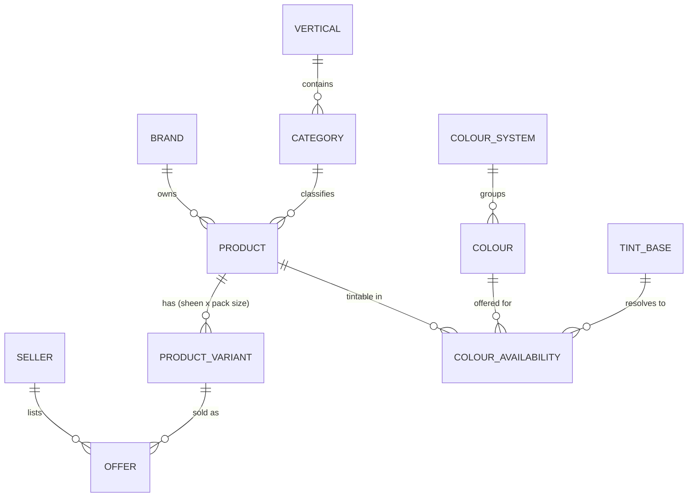
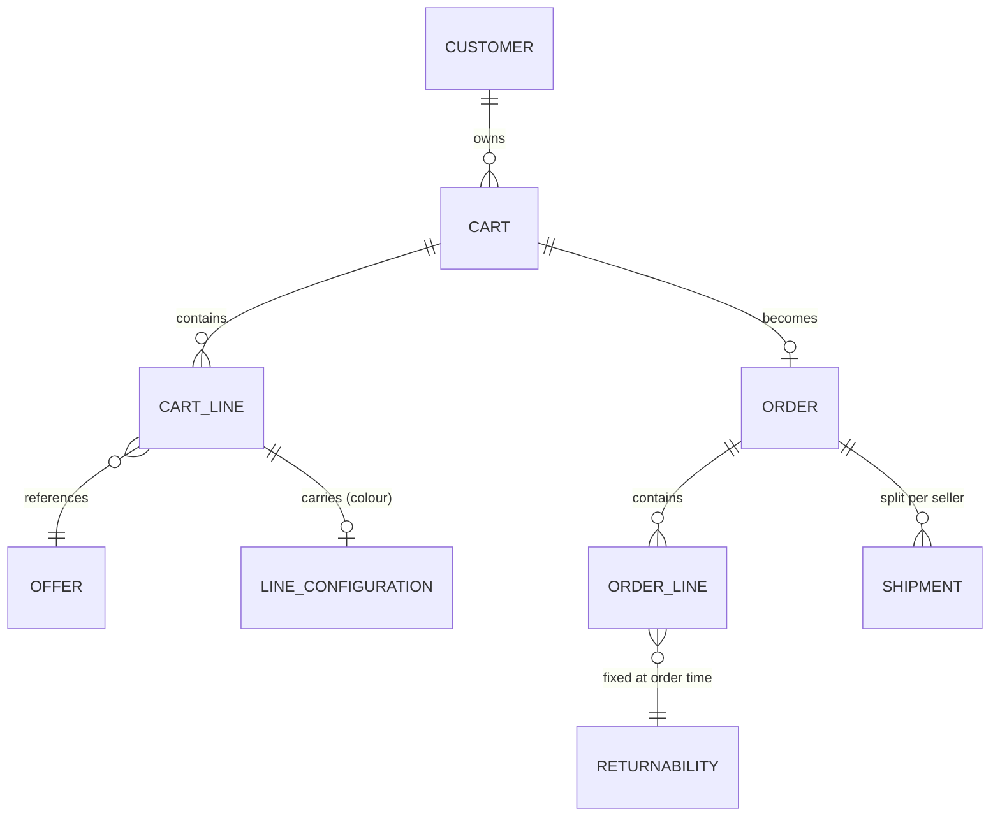

# Data model

The whole platform turns on one decision: **colour is a line-item
configuration, not a variant axis.** Everything below follows from it.

## The problem it solves

Stevensons publishes 180 tintable Real Colours plus a Standard Colours
collection. Model colour as a variant axis and a single topcoat range becomes:

```
180 colours x 3 sheens x 4 pack sizes  =  2,160 variants
x 5 Stevensons topcoat ranges          =  ~10,800 variants
```

...against perhaps a few dozen physically stocked items. The catalogue would be
almost entirely fictional rows.

Model colour as configuration instead and the same range is **12 real variants**
(3 sheens x 4 pack sizes). The colour rides on the order line.

## Catalogue and colour



### Why `COLOUR_AVAILABILITY` is the important table

It is the join that makes runtime pricing possible. For a given
`(product, colour)` it answers two questions at once:

1. **Can this product be tinted to this colour at all?** Not every range
   supports every colour.
2. **Which tint base does it resolve to?** White, Pastel, Medium, Deep or
   Accent — and the base is what drives the price uplift.

Without this table, price cannot be computed and the storefront cannot show a
number.

## Entities

### Marketplace spine

| Entity | Purpose | Notes |
| --- | --- | --- |
| `Vertical` | Just Paints, Just Tools | Owns a subdomain, a theme and a category tree |
| `Seller` | Stevensons | Commission rate, fulfilment mode, payout details |
| `Brand` | Stevensons, Crest, Metalrite | A seller may carry several brands |
| `Category` | Interior / Exterior / Roof | Tree, scoped to a vertical |

### Catalogue

| Entity | Key fields |
| --- | --- |
| `Product` | `brandId`, `categoryId`, `verticalId`, `name`, `slug`, `coveragePerLitre`, `coatsRecommended` |
| `ProductVariant` | `sku`, `sheen`, `packSizeLitres`, `weightKg`, `dimsMm`, `hazardClass`, `basePriceExVat` |
| `Offer` | `sellerId`, `variantId`, `priceExVat`, `stockQty`, `leadTimeDays`, `fulfilmentMode` |

`Offer` exists from day one even though there is only one seller. Adding it
later means rewriting pricing, cart, orders and payouts simultaneously — it is
the one piece of Phase 3 that cannot be deferred.

### Colour

| Entity | Key fields |
| --- | --- |
| `ColourSystem` | `name` (Stevensons Real Colours), `ownerSellerId`, `isProprietary` |
| `Colour` | `code` (RC47), `name` (Guinness), `hex`, `rgb`, `lrv`, `hueFamily`, `colourSystemId` |
| `TintBase` | `name` (White/Pastel/Medium/Deep/Accent), `upliftPerLitreExVat` |
| `ColourAvailability` | `productId`, `colourId`, `tintBaseId`, `isDiscontinued` |
| `TintRecipe` | `colourId`, `tintBaseId`, `productLineId`, `dispenseData` (opaque) |

`hex` and `lrv` are **not published** by Stevensons today. Treat them as
nullable, and degrade gracefully: a colour without `hex` renders from a swatch
image; a colour without `lrv` hides the light-reflectance filter. The catalogue
must work before the data is perfect.

`TintRecipe` may be proprietary and may never be shared. The platform does not
need it to sell — only to print on a dispensing docket. Keep it optional and
opaque.

## Pricing

Price is **resolved, never stored** on the variant:

```
priceExVat = offer.priceExVat
           + (tintBase.upliftPerLitreExVat x variant.packSizeLitres)
           + colourantSurcharge          // optional, usually zero
           x customerTier.multiplier     // 1.0 retail; trade tiers in Phase 2

priceIncVat = priceExVat x 1.15          // SA VAT, display-inclusive
```

Two rules that are easy to get wrong:

1. **Round at the end, once**, to 2 decimals, on the VAT-inclusive figure.
   Rounding the uplift separately produces cents-level drift that shows up as
   basket totals that do not add up.
2. **Snapshot the resolved price on the cart line.** Prices and colour data
   change. A customer must pay what they were shown.

## Cart and order



### `LineConfiguration`

The paint-specific payload on a cart or order line:

| Field | Why |
| --- | --- |
| `colourId`, `colourCode`, `colourName`, `colourHex` | Snapshotted — the colour record may be edited or discontinued later |
| `tintBaseId`, `tintBaseName` | Determines price and the dispensing docket |
| `isMadeToOrder` | True whenever a tint is applied; false for factory white |
| `resolvedPriceExVat` | What the customer was actually shown |

Snapshotting is not redundancy. An order placed in March must still print
correctly in September after the colour has been renamed or withdrawn.

### Returnability

Computed **once, at order placement**, and stored on the line:

| Value | When | Basis |
| --- | --- | --- |
| `Returnable` | Factory white, sundries, tools | ECTA 7-day cooling-off applies |
| `NonReturnableCustomMixed` | Any tinted line | ECTA excludes goods made to consumer specification |
| `ReturnableDefectOnly` | Tinted but off-specification | Still returnable if it does not match what was ordered |

Never recompute this from current rules — the rule that applied is the rule at
the time of sale. Disclose it at add-to-cart, not in terms and conditions.

## Fulfilment

| Concern | Model |
| --- | --- |
| Split shipments | One `Shipment` per seller per order, from day one |
| Shipping cost | Computed from `weightKg` and `dimsMm`, never flat-rate — a 20L tin is ~25kg |
| Hazard | `hazardClass` on the variant; solvent-based is flammable and restricts couriers |
| Lead time | `Offer.leadTimeDays` plus tint-to-dispatch SLA for made-to-order lines |

## Trade accounts (Phase 2)

| Entity | Key fields |
| --- | --- |
| `TradeAccount` | `customerId`, `companyName`, `companyReg`, `vatNumber`, `tierId`, `creditTermsDays` |
| `PricingTier` | `name`, `multiplier` or explicit price list |
| `Quote` | A cart frozen with an expiry, convertible to an order |

## Marketplace money (Phase 3)

| Entity | Key fields |
| --- | --- |
| `CommissionRule` | Per seller, per category, or flat |
| `SettlementLine` | Per order line: gross, commission, net to seller |
| `Payout` | Batched settlement lines, reconciled against gateway split records |

Until Phase 3 there is one seller and reconciliation is a spreadsheet. Build the
entities, defer the automation.
